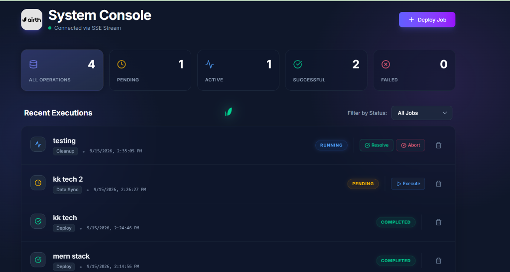

# Airth - Job Queue System 🚀


<br>

<br>

A full-stack job queue dashboard built for the **Airth Software Engineering Intern Assignment**. It provides a premium, robust interface to monitor and manage background processes.

---

## ✨ Features Highlight

### 📋 Core Requirements Met
- **Full API Suite**: `POST /jobs`, `GET /jobs`, `PATCH /jobs/:id/status`, `DELETE /jobs/:id`
- **Data Persistence**: Backed by a SQLite database using TypeORM for zero-configuration testing.
- **Job Entity**: Contains strictly typed `id` (UUID), `title`, `type`, `status` (Enum: `pending`, `running`, `completed`, `failed`), and `createdAt` timestamps.
- **Frontend Dashboard**: A comprehensive UI to view all jobs, filter by status dynamically, deploy new jobs via a modal, update job execution states, and view aggregate statistic counts.

### 🌟 Advanced Engineering Features
*To demonstrate readiness for a production environment, this project includes several advanced implementations beyond the core requirements:*

- **Real-Time UI Synchronization (SSE):** The backend streams live updates to the frontend using **Server-Sent Events (SSE)**. If multiple users have the dashboard open in different tabs, updating a job status in one tab instantly updates the dashboard in all other tabs without a page refresh!
- **Optimistic Concurrency Control (Race Condition Prevention):** The backend database utilizes conditional SQL updates to prevent race conditions. If two users simultaneously attempt to execute a `pending` job, only the first request succeeds; the second receives a `409 Conflict` error, guaranteeing data integrity.
- **Premium Fluid UI & Physics Animations:** The frontend utilizes advanced glassmorphism, Tailwind v4 CSS techniques, and a custom `requestAnimationFrame` fluid physics mouse-trailer showcasing the company brand.

---

## 🛠 Tech Stack

- **Frontend:** React, Vite, Tailwind CSS v4, React Query (TanStack), Lucide Icons
- **Backend:** NestJS, TypeScript, TypeORM, RxJS (for SSE streams)
- **Database:** SQLite (via `better-sqlite3` driver)

---

## 🚀 Quick Start Guide

### Prerequisites
Make sure you have Node.js (v18+) installed.

### 1. Start the Backend
The backend runs on `http://localhost:3000`.

```bash
cd backend
npm install
npm run start:dev
```
*(Note: A local `jobs.db` SQLite file will be automatically created on startup.)*

### 2. Start the Frontend
Open a new terminal window. The frontend runs on `http://localhost:5173`.

```bash
cd frontend
npm install
npm run dev
```

Open [http://localhost:5173](http://localhost:5173) in your browser to view the application!

---

## 📖 API Documentation

The following endpoints are exposed on `http://localhost:3000`:

| Method | Endpoint | Description | Payload Example |
|---|---|---|---|
| **GET** | `/jobs` | Retrieve all jobs from the database | None |
| **POST** | `/jobs` | Create a new job | `{ "title": "Data Sync", "type": "Sync" }` |
| **PATCH** | `/jobs/:id/status`| Update the status of a specific job | `{ "status": "running" }` |
| **DELETE**| `/jobs/:id` | Delete a specific job | None |
| **GET** | `/jobs/stream` | (SSE) Subscribe to live job updates stream | None |

---

### Design Philosophy
The goal was to build a system that is not only functionally flawless but also provides a "Wow" factor. From robust error handling in the API to micro-interactions in the UI, every detail has been crafted to simulate a real, high-quality enterprise dashboard.

---

## 🧠 Important Decisions & Trade-offs

- **SQLite Database:** Used SQLite for simplicity and zero-configuration testing. It makes the app easily portable for review without needing a separate PostgreSQL/Docker setup.
- **Optimistic Concurrency Control:** Instead of a complex queue system like Redis/BullMQ (which would add significant setup overhead for a reviewer), race conditions were solved using SQL `UPDATE ... WHERE status = 'pending'`. This is a practical trade-off that maintains data integrity while keeping the architecture simple.
- **Server-Sent Events (SSE) vs WebSockets:** Chose SSE over WebSockets because the data flow is strictly unidirectional (Server to Client). SSE is lighter, natively supported by browsers, and perfect for real-time dashboard updates without the overhead of maintaining full duplex WebSocket connections.

## 🚀 Future Improvements (With More Time)
1. **Pagination & Filtering API:** Currently, the frontend fetches all jobs and filters them client-side. With more time, I would implement cursor-based pagination and server-side filtering to handle millions of jobs.
2. **Persistent Queueing (Redis):** For a production-grade system, I would introduce BullMQ or RabbitMQ to handle job retries, delays, and dead-letter queues.
3. **Authentication & Authorization:** Add JWT-based login and Role-Based Access Control (RBAC) so only admins can execute or delete jobs.
